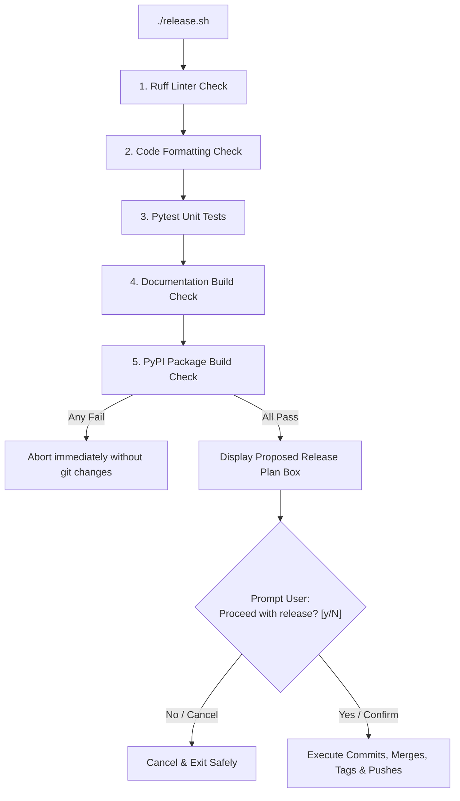

# Automatic Versioning & Release Pipeline (`release.sh`)

This project employs an automated, interactive release pipeline driven by the root-level script **[`release.sh`](file:///Users/haddagart/Developer/haddagart/templates/tensoris/release.sh)**. It coordinates PEP 440 version parsing, local pre-commit verification, major version branching (`release/vX`), git branch merges, PyPI package distribution, and multi-version documentation deployment (`mike`).

---

## 1. One-Command Interactive Release Script (`release.sh`)

To publish a pre-release or stable version, run the `./release.sh` script from the project root:

```bash
# View script help & usage examples
./release.sh --help

# Deploy a Beta Pre-Release (targets dev branch & dev docs)
./release.sh 1.0.0b1

# Deploy an Official Stable Release (merges dev -> main & sets latest docs)
./release.sh 1.0.0
```

### Safety & Verification Pipeline

When executed, `./release.sh` runs through a 3-step safety architecture:



1. **Local Pre-Commit Testing**: Simulates GitHub Actions locally (`ruff check`, `ruff format`, `pytest`, `properdocs build`, `uv build`). If any step fails, the script aborts immediately without touching git.
2. **Execution Plan Box**: Displays a clear summary of target version, release type, major branch (`release/v1`), and proposed actions.
3. **Interactive User Confirmation**: Asks for explicit user confirmation (`[y/N]`) before executing git commits, tags, branch merges, and remote pushes.

---

## 2. Branching Architecture Policy

The codebase enforces a strict separation between development and release branches:

- **`working` Branch**: The primary active workspace. All daily coding, feature additions, and commits occur here.
- **`dev` Branch**: Reserved strictly for Pre-Release deployments (`alpha`, `beta`, `rc`).
- **`main` Branch**: Reserved strictly for Official Stable Releases (`1.0.0`, `1.1.0`).
- **`release/vX` Branches**: Major version release tracking branches (`release/v1`).

> [!NOTE]
> Running `./release.sh` merges `working` into `dev` or `main`, tags the release, pushes to remote, and automatically returns your active git checkout to **`working`**.

---

## 3. PEP 440 Compliant Versioning Standard

Package versioning strictly adheres to Python **PEP 440**. Use the following tag conventions to control your release stage:

| Stage                 | Command Example         | Target Branch | PyPI Version | Docs Selector      |
| :-------------------- | :---------------------- | :------------ | :----------- | :----------------- |
| **Alpha**             | `./release.sh 1.0.0a1`  | `dev`         | `1.0.0a1`    | `dev`              |
| **Beta**              | `./release.sh 1.0.0b1`  | `dev`         | `1.0.0b1`    | `dev`              |
| **Release Candidate** | `./release.sh 1.0.0rc1` | `dev`         | `1.0.0rc1`   | `dev`              |
| **Stable Release**    | `./release.sh 1.0.0`    | `main`        | `1.0.0`      | `1.0.0` & `latest` |
| **Minor Release**     | `./release.sh 1.1.0`    | `main`        | `1.1.0`      | `1.1.0` & `latest` |

---

## 3. Dynamic Version Access in Code (`hatch-vcs`)

Version strings are generated dynamically from Git tags via `hatch-vcs`.

```python
import tensoris

print(tensoris.__version__)
# Output on tag v1.0.0b1: "1.0.0b1"
# Output on tag v1.0.0:   "1.0.0"
```

---

## 4. Multi-Version Documentation Selector (`mike`)

The documentation site uses **`mike`** to maintain version dropdowns:

- **Pre-Releases (`dev`)**: `./release.sh 1.0.0b1` deploys to the `dev` alias.
- **Stable Releases (`latest`)**: `./release.sh 1.0.0` deploys version `1.0.0`, updates the `latest` alias, and sets `latest` as the default site view.

### Local Documentation Verification

```bash
# Serve multi-version documentation site locally
uv run mike serve
```
