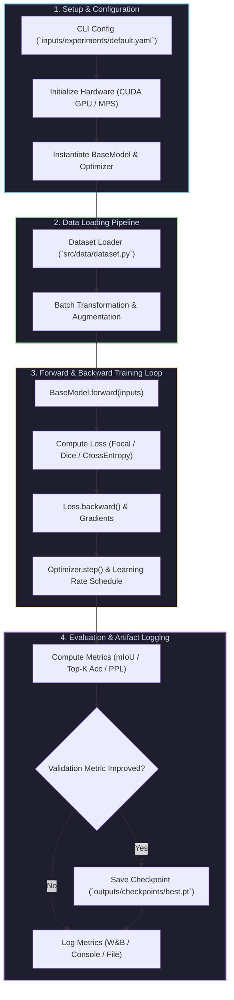

# Workflow Scripts & Execution Loop

This page details the primary entrypoint scripts under `scripts/` used for PyTorch model training, hyperparameter tuning, evaluation, and exporting.

---

## 📊 Trainer & BaseModel Execution Flowchart

The diagram below illustrates the end-to-end execution loop managed by `scripts/train.py`, connecting hyperparameter configuration, dataset batch loading, `BaseModel` forward pass, loss computation, backward pass, gradient updates, metric logging, and checkpoint saving.

---

## 🛠️ Execution Entrypoints

- `scripts/train.py`: Primary PyTorch model training loop supporting YAML configuration overrides, mixed precision (`fp16`), and metric logging.
- `scripts/evaluate.py`: Validation set evaluation and metric calculation (Accuracy, MeanIoU, Perplexity, FID Score).
- `scripts/export.py`: Trained PyTorch checkpoint exporter to ONNX and TorchScript deployment binaries.